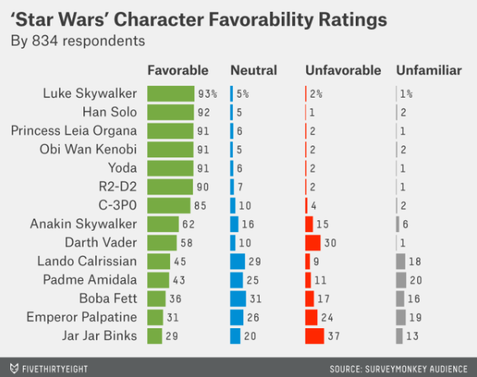

## Introduction

For this exercise, I will recreate the following figure from FiveThirtyEight's article, **America's Favorite 'Star Wars' Movies (And Least Favorite Characters)**. 


*Original visualization from FiveThirtyEight.*

The data used to recreate this figure comes from FiveThirtyEight's publically available GitHub repository and is located within the star-wars-survey dataset: https://github.com/fivethirtyeight/data/tree/master/star-wars-survey

## Load Data

```{r}
# Load libraries.
library("readr")
library("tidyverse")
library("dplyr")
library("ggplot2")
```

```{r}
# I downloaded the dataset from GitHub and put it into the presentation-exercise folder. I want to confirm that the .CSV file is accessible.

list.files()
```
```{r}
# I confirmed that the .csv file is accessible. Now, I will load the data.
# Note that the dataset contains special characters. 

starwarsdata <- read_csv(
  "starwars.csv",
  locale = locale(encoding = "ISO-8859-1")
)
```

```{r}
# Examine the data.
glimpse(starwarsdata)
colnames(starwarsdata)
```

## Using AI to Re-Create the Orginal Graph

This week's assignment asks us to use an AI of our choice to recreate the graph. I will be using ChatGPT-5.2 to complete this assignment. 

# Prompt 1 

Prior to asking ChatGPT-5.2 to re-create the original figure, I provided the results from glimpse() and colnames(). Prompt 1 is written below: 

*Re-create the graph entitled 'Star Wars' Character Favorability Ratings within this article: https://fivethirtyeight.com/features/americas-favorite-star-wars-movies-and-least-favorite-characters/. Note that an image of the graph is being provided.*

*The data used to generate this figure is stored in a .csv file, entitled 'StarWars.csv.' Note that this file is being provided. The data can be found through the following link: https://github.com/fivethirtyeight/data/tree/master/star-wars-survey.*

*Provide the script needed to re-create this figure. Make sure that it is in R.*

```{r}
# Below is the script that ChatGPT-5.2 provided based on Prompt 1. Note that a .png of the original figure and the .csv file were provided to ChatGPT-5.2. 

character_names <- c(
  "Luke Skywalker",
  "Han Solo",
  "Princess Leia Organa",
  "Anakin Skywalker",
  "Obi Wan Kenobi",
  "Emperor Palpatine",
  "Darth Vader",
  "Lando Calrissian",
  "Boba Fett",
  "C-3PO",
  "R2-D2",
  "Jar Jar Binks",
  "Padme Amidala"
)

character_cols <- names(starwarsdata)[17:29]

character_long <- starwarsdata %>%
  select(all_of(character_cols)) %>%
  set_names(character_names) %>%
  pivot_longer(
    cols = everything(),
    names_to = "Character",
    values_to = "Response"
  ) %>%
  filter(!is.na(Response))

character_long <- character_long %>%
  mutate(
    Sentiment = case_when(
      Response %in% c("Very favorably", "Somewhat favorably") ~ "Favorable",
      Response == "Neither favorably nor unfavorably" ~ "Neutral",
      Response %in% c("Somewhat unfavorably", "Very unfavorably") ~ "Unfavorable",
      Response == "Unfamiliar (N/A)" ~ "Unfamiliar",
      TRUE ~ NA_character_
    )
  ) %>%
  filter(!is.na(Sentiment))

character_summary <- character_long %>%
  count(Character, Sentiment) %>%
  group_by(Character) %>%
  mutate(Percent = 100 * n / sum(n)) %>%
  ungroup()

character_order <- character_summary %>%
  filter(Sentiment == "Favorable") %>%
  arrange(desc(Percent)) %>%
  pull(Character)

character_summary$Character <- factor(
  character_summary$Character,
  levels = rev(character_order)
)

sentiment_colors <- c(
  Favorable   = "#7CB342",
  Neutral     = "#4FC3F7",
  Unfavorable = "#E53935",
  Unfamiliar  = "#BDBDBD"
)

ggplot(character_summary,
       aes(x = Percent, y = Character, fill = Sentiment)) +
  geom_col(width = 0.75, color = "white", size = 0.2) +
  scale_fill_manual(values = sentiment_colors) +
  scale_x_continuous(limits = c(0, 100), expand = c(0, 0)) +
  labs(
    title = "‘Star Wars’ Character Favorability Ratings",
    subtitle = "By 834 respondents",
    x = NULL,
    y = NULL,
    fill = NULL
  ) +
  theme_minimal(base_size = 12) +
  theme(
    panel.grid.major.y = element_blank(),
    panel.grid.minor = element_blank(),
    panel.grid.major.x = element_blank(),
    axis.text.x = element_blank(),
    plot.title = element_text(face = "bold"),
    legend.position = "bottom"
  ) +
  guides(fill = guide_legend(nrow = 1))
```

# Prompt 2 

The graph generated from Prompt 1 contained all the right information. However, it did not look like the original. Prompt 2, written below, tries to remedy this. 

*Review the image provided. Note that 'favorable', 'neutral', 'unfavorable', and 'unfamiliar' categories are spaced apart (not a stacked bar graph) and have percentage values written at the end of each bar. Edit the provided code to reflect this.*

```{r}
character_names <- c(
  "Luke Skywalker",
  "Han Solo",
  "Princess Leia Organa",
  "Anakin Skywalker",
  "Obi Wan Kenobi",
  "Emperor Palpatine",
  "Darth Vader",
  "Lando Calrissian",
  "Boba Fett",
  "C-3PO",
  "R2-D2",
  "Jar Jar Binks",
  "Padme Amidala"
)

character_cols <- names(starwarsdata)[17:29]
character_long <- starwarsdata %>%
  select(all_of(character_cols)) %>%
  set_names(character_names) %>%
  pivot_longer(
    cols = everything(),
    names_to = "Character",
    values_to = "Response"
  ) %>%
  filter(!is.na(Response))

character_long <- character_long %>%
  mutate(
    Sentiment = case_when(
      Response %in% c("Very favorably", "Somewhat favorably") ~ "Favorable",
      Response == "Neither favorably nor unfavorably" ~ "Neutral",
      Response %in% c("Somewhat unfavorably", "Very unfavorably") ~ "Unfavorable",
      Response == "Unfamiliar (N/A)" ~ "Unfamiliar",
      TRUE ~ NA_character_
    )
  ) %>%
  filter(!is.na(Sentiment))

character_summary <- character_long %>%
  count(Character, Sentiment) %>%
  group_by(Character) %>%
  mutate(Percent = 100 * n / sum(n)) %>%
  ungroup()

character_order <- character_summary %>%
  filter(Sentiment == "Favorable") %>%
  arrange(desc(Percent)) %>%
  pull(Character)

character_summary$Character <- factor(
  character_summary$Character,
  levels = rev(character_order)
)

character_summary$Sentiment <- factor(
  character_summary$Sentiment,
  levels = c("Favorable", "Neutral", "Unfavorable", "Unfamiliar")
)

sentiment_colors <- c(
  Favorable   = "#7CB342",
  Neutral     = "#4FC3F7",
  Unfavorable = "#E53935",
  Unfamiliar  = "#BDBDBD"
)

ggplot(character_summary,
       aes(x = Percent, y = Character, fill = Sentiment)) +
  geom_col(
    position = position_dodge(width = 0.75),
    width = 0.65
  ) +
  geom_text(
    aes(label = paste0(round(Percent), "%")),
    position = position_dodge(width = 0.75),
    hjust = -0.15,
    size = 3
  ) +
  scale_fill_manual(values = sentiment_colors) +
  scale_x_continuous(
    limits = c(0, 105),
    expand = c(0, 0)
  ) +
  labs(
    title = "‘Star Wars’ Character Favorability Ratings",
    subtitle = "By 834 respondents",
    x = NULL,
    y = NULL,
    fill = NULL
  ) +
  theme_minimal(base_size = 12) +
  theme(
    panel.grid.major.y = element_blank(),
    panel.grid.minor = element_blank(),
    panel.grid.major.x = element_blank(),
    axis.text.x = element_blank(),
    plot.title = element_text(face = "bold"),
    legend.position = "bottom"
  ) +
  guides(fill = guide_legend(nrow = 1))
```

# Prompt 3

*The graph should be wider and have the full title ('Star Wars Character Favorability Ratings') at the top. Bars showing favorability should be next to each other (favorable, neutral, unfavorable, unfamiliar), rather than stacked on top of each other. Ensure that all four categories are present and visible. Revise the code to reflect these changes.*

```{r}
# I manually moved the names around so that they would be in the same order as the original graph. 
# Yoda was not included in prior graphs. I manually revised the code to add him. 
character_names <- c(
  "Luke Skywalker",
  "Han Solo",
  "Princess Leia Organa",
  "Obi Wan Kenobi",
  "Yoda",
  "R2-D2",
  "C-3PO",
  "Anakin Skywalker",
  "Darth Vader",
  "Lando Calrissian",
  "Padme Amidala",
  "Boba Fett",
  "Emperor Palpatine",
  "Jar Jar Binks"
)

character_cols <- names(starwarsdata)[17:30] # Manual change made here.

character_long <- starwarsdata %>%
  select(all_of(character_cols)) %>%
  set_names(character_names) %>%
  pivot_longer(
    cols = everything(),
    names_to = "Character",
    values_to = "Response"
  ) %>%
  filter(!is.na(Response))

character_long <- character_long %>%
  mutate(
    Sentiment = case_when(
      Response %in% c("Very favorably", "Somewhat favorably") ~ "Favorable",
      Response == "Neither favorably nor unfavorably" ~ "Neutral",
      Response %in% c("Somewhat unfavorably", "Very unfavorably") ~ "Unfavorable",
      Response == "Unfamiliar (N/A)" ~ "Unfamiliar",
      TRUE ~ NA_character_
    )
  ) %>%
  filter(!is.na(Sentiment))

character_summary <- character_long %>%
  count(Character, Sentiment) %>%
  group_by(Character) %>%
  mutate(Percent = 100 * n / sum(n)) %>%
  ungroup()

character_summary <- character_summary %>%
  complete(
    Character,
    Sentiment = c("Favorable", "Neutral", "Unfavorable", "Unfamiliar"),
    fill = list(n = 0, Percent = 0)
  )

  character_order <- character_summary %>%
  filter(Sentiment == "Favorable") %>%
  arrange(desc(Percent)) %>%
  pull(Character)

character_summary$Character <- factor(
  character_summary$Character,
  levels = rev(character_order)
)

character_summary$Sentiment <- factor(
  character_summary$Sentiment,
  levels = c("Favorable", "Neutral", "Unfavorable", "Unfamiliar")
)

sentiment_colors <- c(
  Favorable   = "#7CB342",
  Neutral     = "#4FC3F7",
  Unfavorable = "#E53935",
  Unfamiliar  = "#BDBDBD"
)

ggplot(character_summary,
       aes(x = Percent, y = Character, fill = Sentiment)) +
  geom_col(
    position = position_dodge(width = 0.8),
    width = 0.7
  ) +
  geom_text(
    aes(label = paste0(round(Percent), "%")),
    position = position_dodge(width = 0.8),
    hjust = -0.15,
    size = 3
  ) +
  scale_fill_manual(values = sentiment_colors) +
  scale_x_continuous(
    limits = c(0, 105),
    expand = c(0, 0)
  ) +
  labs(
    title = "Star Wars Character Favorability Ratings",
    subtitle = "By 834 respondents",
    x = NULL,
    y = NULL,
    fill = NULL
  ) +
  theme(
    panel.background = element_rect(fill = "#F2F2F2", color = NA),
    plot.background  = element_rect(fill = "#F2F2F2", color = NA),
    panel.grid.major.y = element_blank(),
    panel.grid.minor = element_blank(),
    panel.grid.major.x = element_blank(),
    axis.text.x = element_blank(),
    plot.title = element_text(face = "bold", size = 16),
    plot.subtitle = element_text(size = 12),
    legend.position = "bottom"
  ) +
  guides(fill = guide_legend(nrow = 1))
```

# Prompt 4 

*Notice how the horizontal bars are next to each other in the original graph, rather than stacked on top of each other, as if there were four aligned mini bar charts. Revise the code to re-create this. Lock character order and colors.*

```{r}
character_names <- c(
  "Luke Skywalker",
  "Han Solo",
  "Princess Leia Organa",
  "Obi Wan Kenobi",
  "Yoda",
  "R2-D2",
  "C-3PO",
  "Anakin Skywalker",
  "Darth Vader",
  "Lando Calrissian",
  "Padme Amidala",
  "Boba Fett",
  "Emperor Palpatine",
  "Jar Jar Binks"
)
character_cols <- names(starwarsdata)[17:30]

stopifnot(length(character_names) == length(character_cols))

character_long <- starwarsdata %>%
  select(all_of(character_cols)) %>%
  set_names(character_names) %>%
  pivot_longer(
    cols = everything(),
    names_to = "Character",
    values_to = "Response"
  ) %>%
  filter(!is.na(Response))

character_long <- character_long %>%
  mutate(
    Sentiment = case_when(
      Response %in% c("Very favorably", "Somewhat favorably") ~ "Favorable",
      Response == "Neither favorably nor unfavorably" ~ "Neutral",
      Response %in% c("Somewhat unfavorably", "Very unfavorably") ~ "Unfavorable",
      Response == "Unfamiliar (N/A)" ~ "Unfamiliar"
    )
  )

  character_summary <- character_long %>%
  count(Character, Sentiment) %>%
  group_by(Character) %>%
  mutate(Percent = 100 * n / sum(n)) %>%
  ungroup() %>%
  complete(
    Character,
    Sentiment = c("Favorable", "Neutral", "Unfavorable", "Unfamiliar"),
    fill = list(n = 0, Percent = 0)
  )

  character_summary$Character <- factor(
  character_summary$Character,
  levels = rev(character_names)
)

character_summary$Sentiment <- factor(
  character_summary$Sentiment,
  levels = c("Favorable", "Neutral", "Unfavorable", "Unfamiliar")
)

sentiment_colors <- c(
  Favorable   = "#7CB342",
  Neutral     = "#4FC3F7",
  Unfavorable = "#E53935",
  Unfamiliar  = "#BDBDBD"
)

ggplot(character_summary,
       aes(x = Percent, y = Character, fill = Sentiment)) +
  geom_col(width = 0.65) +
  geom_text(
    aes(label = paste0(round(Percent), "%")),
    hjust = -0.15,
    size = 3
  ) +
  facet_grid(. ~ Sentiment, scales = "free_x", space = "free_x") +
  scale_fill_manual(values = sentiment_colors) +
  scale_x_continuous(limits = c(0, 100), expand = c(0, 0)) +
  labs(
    title = "'Star Wars' Character Favorability Ratings",
    subtitle = "By 834 respondents",
    x = NULL,
    y = NULL
  ) +
  theme_minimal(base_size = 12) +
  theme(
    panel.background = element_rect(fill = "#F2F2F2", color = NA),
    plot.background  = element_rect(fill = "#F2F2F2", color = NA),
    panel.grid.major.y = element_blank(),
    panel.grid.major.x = element_blank(),
    strip.text = element_text(face = "bold"),
    axis.text.x = element_blank(),
    legend.position = "none",
    plot.title = element_text(face = "bold", size = 16),
    plot.subtitle = element_text(size = 12)
  )
```

# Prompt 5 

The generated graph is reporting that no responded with **neutral**. Instead, it seems to be reporting it as **NA**.

*Revise the script to treat "Neither favorably nor unfavorably (neutral)" as neutral. Add extra spacing between Favorable and Neutral so the labels don't get cut off.* 

```{r}
character_names <- c(
  "Luke Skywalker",
  "Han Solo",
  "Princess Leia Organa",
  "Obi Wan Kenobi",
  "Yoda",
  "R2-D2",
  "C-3PO",
  "Anakin Skywalker",
  "Darth Vader",
  "Lando Calrissian",
  "Padme Amidala",
  "Boba Fett",
  "Emperor Palpatine",
  "Jar Jar Binks"
)

character_cols <- names(starwarsdata)[17:30]
stopifnot(length(character_names) == length(character_cols))

character_long <- starwarsdata %>%
  select(all_of(character_cols)) %>%
  set_names(character_names) %>%
  pivot_longer(
    cols = everything(),
    names_to = "Character",
    values_to = "Response"
  ) %>%
  filter(!is.na(Response)) %>%
  mutate(
    Sentiment = case_when(
      Response %in% c("Very favorably", "Somewhat favorably") ~ "Favorable",
      Response == "Neither favorably nor unfavorably (neutral)" ~ "Neutral",
      Response %in% c("Somewhat unfavorably", "Very unfavorably") ~ "Unfavorable",
      Response == "Unfamiliar (N/A)" ~ "Unfamiliar"
    )
  )

character_summary <- character_long %>%
  count(Character, Sentiment) %>%
  group_by(Character) %>%
  mutate(Percent = 100 * n / sum(n)) %>%
  ungroup() %>%
  complete(
    Character,
    Sentiment = c("Favorable", "Neutral", "Unfavorable", "Unfamiliar"),
    fill = list(n = 0, Percent = 0)
  )

character_summary$Character <- factor(
  character_summary$Character,
  levels = rev(character_names)
)

character_summary$Sentiment <- factor(
  character_summary$Sentiment,
  levels = c("Favorable", "Neutral", "Unfavorable", "Unfamiliar")
)

sentiment_colors <- c(
  Favorable   = "#7CB342",
  Neutral     = "#4FC3F7",
  Unfavorable = "#E53935",
  Unfamiliar  = "#BDBDBD"
)

ggplot(
  character_summary,
  aes(x = Percent, y = Character, fill = Sentiment)
) +
  geom_col(width = 0.65) +
  geom_text(
    aes(label = paste0(round(Percent), "%")),
    hjust = -0.15,
    size = 3
  ) +
  facet_grid(
    . ~ Sentiment,
    scales = "free_x",
    space = "fixed"
  ) +
  scale_fill_manual(values = sentiment_colors) +
  scale_x_continuous(
    limits = c(0, 100),
    expand = expansion(mult = c(0, 0.25))
  ) +
  coord_cartesian(clip = "off") +
  labs(
    title = "'Star Wars' Character Favorability Ratings",
    subtitle = "By 834 respondents",
    x = NULL,
    y = NULL
  ) +
  theme_minimal(base_size = 12) +
  theme(
    plot.background = element_rect(fill = "#F2F2F2", color = NA),
    panel.background = element_rect(fill = "#F2F2F2", color = NA),
    panel.grid.major.y = element_blank(),
    panel.grid.major.x = element_blank(),
    panel.grid.minor = element_blank(),
    strip.text = element_text(face = "bold"),
    axis.text.x = element_blank(),
    legend.position = "none",
    plot.title = element_text(face = "bold", size = 16),
    plot.subtitle = element_text(size = 12)
  )
```

# Prompt 6 

The data for Jar Jar Binks is missing. There is also no need to have a column for reponses marked as NA. Prompt 6 is written below: 

*Revise the code to include data for Jar Jar Binks and to remove the column for responses marked as NA. Revise the code to that the colors match that of the original (light grey background). Preserve character order, percentages, and four aligned mini bar graphs.* 

```{r}
character_names <- c(
  "Luke Skywalker",
  "Han Solo",
  "Princess Leia Organa",
  "Obi Wan Kenobi",
  "Yoda",
  "R2-D2",
  "C-3PO",
  "Anakin Skywalker",
  "Darth Vader",
  "Lando Calrissian",
  "Padme Amidala",
  "Boba Fett",
  "Emperor Palpatine",
  "Jar Jar Binks"
)

character_cols <- names(starwarsdata)[17:30]
stopifnot(length(character_names) == length(character_cols))

character_long <- starwarsdata %>%
  select(all_of(character_cols)) %>%
  set_names(character_names) %>%
  pivot_longer(
    cols = everything(),
    names_to = "Character",
    values_to = "Response"
  ) %>%
  filter(!is.na(Response)) %>%
  mutate(
    Sentiment = case_when(
      Response %in% c("Very favorably", "Somewhat favorably") ~ "Favorable",
      Response == "Neither favorably nor unfavorably (neutral)" ~ "Neutral",
      Response %in% c("Somewhat unfavorably", "Very unfavorably") ~ "Unfavorable",
      Response == "Unfamiliar (N/A)" ~ "Unfamiliar",
      TRUE ~ NA_character_
    )
  ) %>%
  filter(!is.na(Sentiment))

character_summary <- character_long %>%
  count(Character, Sentiment) %>%
  group_by(Character) %>%
  mutate(Percent = 100 * n / sum(n)) %>%
  ungroup() %>%
  complete(
    Character,
    Sentiment = c("Favorable", "Neutral", "Unfavorable", "Unfamiliar"),
    fill = list(n = 0, Percent = 0)
  )

character_summary$Character <- factor(
  character_summary$Character,
  levels = rev(character_names)
)

character_summary$Sentiment <- factor(
  character_summary$Sentiment,
  levels = c("Favorable", "Neutral", "Unfavorable", "Unfamiliar")
)

sentiment_colors <- c(
  Favorable   = "#7CB342",
  Neutral     = "#4FC3F7",
  Unfavorable = "#E53935",
  Unfamiliar  = "#BDBDBD"
)

ggplot(
  character_summary,
  aes(x = Percent, y = Character, fill = Sentiment)
) +
  geom_col(width = 0.65) +
  geom_text(
    aes(label = paste0(round(Percent), "%")),
    hjust = -0.15,
    size = 3
  ) +
  facet_grid(
    . ~ Sentiment,
    scales = "free_x",
    space = "fixed"
  ) +
  scale_fill_manual(values = sentiment_colors) +
  scale_x_continuous(
    limits = c(0, 100),
    expand = expansion(mult = c(0, 0.25))
  ) +
  coord_cartesian(clip = "off") +
  labs(
    title = "'Star Wars' Character Favorability Ratings",
    subtitle = "By 834 respondents",
    x = NULL,
    y = NULL
  ) +
  theme_minimal(base_size = 12) +
  theme(
    plot.background = element_rect(fill = "#F2F2F2", color = NA),
    panel.background = element_rect(fill = "#F2F2F2", color = NA),
    panel.grid.major.y = element_blank(),
    panel.grid.major.x = element_blank(),
    panel.grid.minor = element_blank(),
    strip.text = element_text(face = "bold"),
    axis.text.x = element_blank(),
    legend.position = "none",
    plot.title = element_text(face = "bold", size = 16),
    plot.subtitle = element_text(size = 12)
  )
```

# Prompt 7 

While the figure looks similar to the original, the percentages are off. To correct this, I went in and wrote code. ChatGPT-5.2/AI was not prompted to generate code to re-create the figure here; instead, I replaced a few lines to get the desired result. 

```{r}
character_names <- c(
  "Luke Skywalker",
  "Han Solo",
  "Princess Leia Organa",
  "Obi Wan Kenobi",
  "Yoda",
  "R2-D2",
  "C-3PO",
  "Anakin Skywalker",
  "Darth Vader",
  "Lando Calrissian",
  "Padme Amidala",
  "Boba Fett",
  "Emperor Palpatine",
  "Jar Jar Binks"
)

character_cols <- names(starwarsdata)[17:30]
stopifnot(length(character_names) == length(character_cols))

character_summary <- tibble(
  Character = rep(character_names, each = 4),
  Sentiment = rep(
    c("Favorable", "Neutral", "Unfavorable", "Unfamiliar"),
    times = length(character_names)
  ),
  Percent = c(
    # Luke Skywalker
    93, 5, 2, 1,
    # Han Solo
    92, 5, 1, 2,
    # Princess Leia Organa
    91, 6, 2, 1,
    # Obi Wan Kenobi
    91, 5, 2, 2,
    # Yoda
    91, 6, 2, 1,
    # R2-D2
    90, 7, 2, 1,
    # C-3PO
    85,10, 4, 2,
    # Anakin Skywalker
    62,16,15, 6,
    # Darth Vader
    58,10,30, 1,
    # Lando Calrissian
    45,29, 9,18,
    # Padme Amidala
    43,25,11,20,
    # Boba Fett
    36,31,17,16,
    # Emperor Palpatine
    39,26,24,19,
    # Jar Jar Binks
    29,20,37,13
  )
)

character_summary$Character <- factor(
  character_summary$Character,
  levels = rev(character_names)
)

character_summary$Sentiment <- factor(
  character_summary$Sentiment,
  levels = c("Favorable", "Neutral", "Unfavorable", "Unfamiliar")
)

sentiment_colors <- c(
  Favorable   = "#7CB342",
  Neutral     = "#4FC3F7",
  Unfavorable = "#E53935",
  Unfamiliar  = "#BDBDBD"
)

ggplot(
  character_summary,
  aes(x = Percent, y = Character, fill = Sentiment)
) +
  geom_col(width = 0.65) +
  geom_text(
    aes(label = paste0(round(Percent), "%")),
    hjust = -0.15,
    size = 3
  ) +
  facet_grid(
    . ~ Sentiment,
    scales = "free_x",
    space = "fixed"
  ) +
  scale_fill_manual(values = sentiment_colors) +
  scale_x_continuous(
    limits = c(0, 100),
    expand = expansion(mult = c(0, 0.25))
  ) +
  coord_cartesian(clip = "off") +
  labs(
    title = "'Star Wars' Character Favorability Ratings",
    subtitle = "By 834 respondents",
    x = NULL,
    y = NULL
  ) +
  theme_minimal(base_size = 12) +
  theme(
    plot.background = element_rect(fill = "#F2F2F2", color = NA),
    panel.background = element_rect(fill = "#F2F2F2", color = NA),
    panel.grid.major.y = element_blank(),
    panel.grid.major.x = element_blank(),
    panel.grid.minor = element_blank(),
    strip.text = element_text(face = "bold"),
    axis.text.x = element_blank(),
    legend.position = "none",
    plot.title = element_text(face = "bold", size = 16),
    plot.subtitle = element_text(size = 12)
  )
```

# Comparison


*Original visualization from FiveThirtyEight.*

The figure generated with AI looks incredibly similar to the original figure. I did manually edit the code at the end to ensure that the correct percentages were being displayed, as I'm sure it would have taken several revisions to get the same result with ChatGPT-5.2. It is possible that this issue arose because I did not specify to lock in the character order with my first few prompts (and manually re-organized the order somewhere down the line), but regardless, the issue has been resolved. 

These data indicate that Luke Skywalker is the most favorable character and that Jar Jar Binks is the least favorable character in Star Wars (or at least, among the characters included in the poll). 

## Creating a Table 

```{r}
# Load additional libraries.
library(gt)
library(scales)
```

```{r}
# Generate tibble to create table in downstream analysis.

starwars_table <- tibble(
  Character = c(
    "Luke Skywalker", "Han Solo", "Princess Leia Organa",
    "Obi Wan Kenobi", "Yoda", "R2-D2", "C-3PO",
    "Anakin Skywalker", "Darth Vader", "Lando Calrissian",
    "Padme Amidala", "Boba Fett", "Emperor Palpatine",
    "Jar Jar Binks"
  ),
  Favorable   = c(93, 92, 91, 91, 91, 90, 85, 62, 58, 45, 43, 36, 39, 29),
  Neutral     = c( 5,  5,  6,  5,  6,  7, 10, 16, 10, 29, 25, 31, 26, 20),
  Unfavorable = c( 2,  1,  2,  2,  2,  2,  4, 15, 30,  9, 11, 17, 24, 37),
  Unfamiliar  = c( 1,  2,  1,  2,  1,  1,  2,  6,  1, 18, 20, 16, 19, 13)
) %>%
  mutate(
    Net_Favorability = Favorable - Unfavorable
  )
```
```{r}
# Generate table.

starwars_table %>%
  gt(rowname_col = "Character") %>%

# Add information regarding headers.

tab_spanner(
    label = "Favorability Breakdown (%)",
    columns = Favorable:Unfamiliar
  ) %>%
  
  tab_spanner(
    label = "Summary Metric",
    columns = Net_Favorability
  ) %>%

# Format the table. 

fmt_percent(
    columns = Favorable:Unfavorable,
    scale_values = FALSE
  ) %>%
  
  cols_align(
    align = "center",
    columns = Favorable:Net_Favorability
  ) %>%

data_color(
    columns = Favorable,
    colors = col_numeric(
      palette = c("#E8F5E9", "#2E7D32"),
      domain = NULL
    )
  ) %>%

fmt_markdown(columns = Character) %>%
  
  tab_style(
    style = cell_text(weight = "bold"),
    locations = cells_row_groups()
  ) %>%

# Include labels. 

cols_label(
    Favorable = "Favorable",
    Neutral = "Neutral",
    Unfavorable = "Unfavorable",
    Unfamiliar = "Unfamiliar",
    Net_Favorability = "Net Favorability"
  ) %>%

tab_header(
    title = md("**Star Wars Character Favorability Summary**"),
    subtitle = "Percentages based on survey respondents"
  ) %>%

tab_caption(
    md("*This table displays the percentage of respondents who view Star Wars characters favorably, neutrally, unfavorably, or are unfamiliar with the character. Additionally, the table reports net favorability. This is the difference between favorable and unfavorable responses, which provides a concise metric for comparing overall audience sentiment across characters. Like the above figure, these data indicate that Luke Skywalker is the most favorable character and that Jar Jar Binks is the least favorable character in Star Wars among the characters included in the poll.*")
  )
```


